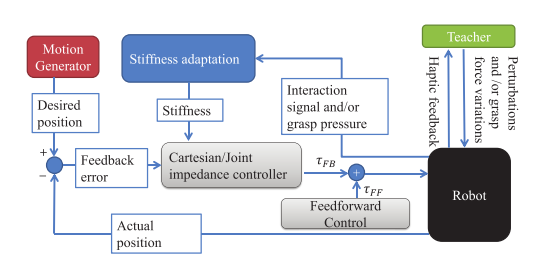

# 2018/01/23
## Learning Compliant Manipulation through Kinesthetic and Tactile Human-Robot Interaction
* abstract
 > Robot Learning from Demonstration (RLfD)

 > Compliant Control: a specific response to physical perturbations.

 1. introducation

 In tasks which involve contact with objects whose positions are not known with perfect certainty, the use of pure position control can cause unbounded rise of the contact force, ultimately leading to dangerous behaviors such as breakage or unstable control. For such tasks, smooth and compliant manipulation requires a controller that regulates the relationship between positional deviations and forces on the robot rather than stiffly following a position or force trajectory.

 2. related work

  * 关节阻尼控制替代位置阻尼控制
  * 交互过程中阻尼（力）学习、示教时有力（触觉）反馈、机器人实时更新阻尼
  * 机器人感知的力/力矩和显示速度用GMM编码，学习后，通过感知力/力矩调整GMM并使用GMR产生速度响应来执行协作（before）
  * 使用自适应控制提高协作任务的表现（不仅是协作任务，还有协作任务中的安全性）
  * 学习可变阻尼控制策略是一个优化控制问题
  > These works specify the task constraints as a cost function and optimize the control actions subject to the dynamics of the robot. This has the advantage that the impedance profile is tailored to each robotic platform. The cost functions used in the optimization typically include a **task performance** term and an energy term.

     > 这些工作将任务约束指定为成本函数，并根据机器人的动态优化控制操作。这具有针对每个机器人平台调整阻尼分布的优点。优化中使用的成本函数通常包括任务执行方面和能源方面。
  * **EM-based RL**可用于学习可变阻尼策略，提高其在多种任务中的任务表现（机器人位置/速度，还有阻尼控制）

 3. Controllers
  * Cartesian Impedance Control
  * Joint Proportional-Derivative Control with Varying Gains

      

 4. INTERFACES FOR TEACHING VARYING STIFFNESS
  * Stiffness Decrease Based on Imposed Perturbations
